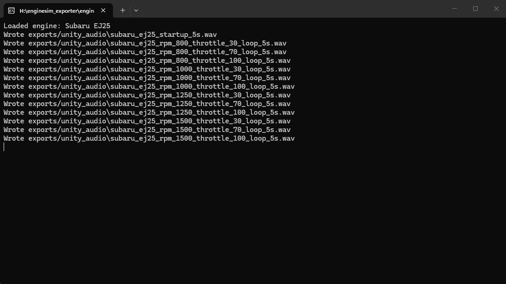

# Engine Sim Exporter



This fork turns Engine Sim into an offline audio exporter for Unity and other game audio pipelines.

It loads an `.mr` engine script, runs the simulation headless, and writes:
- 44.1 kHz, 16-bit, mono WAV files
- a `unity_audio_manifest.csv` file describing every exported clip

The default setup is tuned around the bundled Subaru EJ25 script in `assets/main.mr`, but you can point the exporter at any compatible engine script with `--script`.

## What Gets Exported

Default export set:
- `startup` one-shot
- RPM loop clips at `30%`, `70%`, and `100%` throttle
- `ignition_off` one-shot captured from `1000 RPM`

Default RPM anchors:

`800, 1000, 1250, 1500, 1750, 2000, 2500, 3000, 3500, 4000, 4750, 5500, 6250`

With the default throttle set, that produces:
- `39` RPM loop clips
- `1` startup clip
- `1` ignition-off clip

Total default output: `41` files plus the manifest.

## How The Export System Works

For each target clip, the exporter:
1. Loads the engine script and creates a simulator.
2. Starts the engine and warms it up.
3. Holds the engine at a target RPM and throttle.
4. Renders audio offline instead of in real time.
5. Writes the clip as a WAV file.
6. Adds one manifest row for that clip.

Loop clips render extra tail audio so the exporter can prepare a cleaner wrap point. The current loop pipeline:
- captures the requested clip plus extra continuation audio
- searches forward for a quieter seam near the loop boundary
- applies a short wrap crossfade into the clip head
- trims back to the requested duration

This is meant to make the clips easier to loop in Unity without a hard click at the boundary.

## Output Layout

Default output directory:

`exports/unity_audio`

File naming:
- `subaru_ej25_startup_5s.wav`
- `subaru_ej25_rpm_3000_throttle_70_loop_5s.wav`
- `subaru_ej25_ignition_off_5s.wav`

Manifest columns:

`filename,type,rpm,throttle_percent,loop,duration_seconds`

Notes:
- `type` is `startup`, `rpm_loop`, or `ignition_off`
- `throttle_percent` is blank for one-shots
- the exporter removes previously generated `.wav` files and `unity_audio_manifest.csv` in the target output folder before writing a fresh set

## Build

This project currently builds on Windows.

Exporter-only build:

```powershell
cmake -S . -B build-exporter -DBUILD_APP=OFF -DDISCORD_ENABLED=OFF
cmake --build build-exporter --target engine-sim-exporter --config Release
```

If Flex or Bison are not on your `PATH`, pass them explicitly during configure:

```powershell
cmake -S . -B build-exporter `
  -DBUILD_APP=OFF `
  -DDISCORD_ENABLED=OFF `
  -DFLEX_EXECUTABLE="C:\path\to\win_flex.exe" `
  -DBISON_EXECUTABLE="C:\path\to\win_bison.exe"
```

The app build is not required for exporting audio.

## Run

Run from the repo root:

```powershell
.\build-exporter\Release\engine-sim-exporter.exe --out exports\unity_audio --duration 5 --throttle 30,70,100
```

That uses the default RPM anchor set listed above.

Explicit RPM override:

```powershell
.\build-exporter\Release\engine-sim-exporter.exe --out exports\unity_audio --duration 5 --rpm 800,1000,1250,1500,1750,2000,2500,3000,3500,4000,4750,5500,6250 --throttle 30,70,100
```

Export a different engine script:

```powershell
.\build-exporter\Release\engine-sim-exporter.exe --script assets\engines\atg-video-2\03_2jz.mr --out exports\2jz_audio
```

Show all options:

```powershell
.\build-exporter\Release\engine-sim-exporter.exe --help
```

## CLI Options

- `--script <path>`: engine script to load
- `--out <directory>`: output directory
- `--duration <seconds>`: clip length, default `5`
- `--warmup <seconds>`: warmup before steady RPM capture, default `3`
- `--rpm <list>`: comma-separated RPM anchors; fully overrides the default set
- `--throttle <list>`: comma-separated throttle percentages, default `30,70,100`
- `--no-startup`: skip startup clip
- `--no-ignition-off`: skip ignition-off clip
- `--loop-crossfade <ms>`: wrap smoothing amount, default `20`

## Using The Files In Unity

Typical Unity-side setup:
- import the WAV files as regular audio assets
- mark `rpm_loop` clips as looping
- use `unity_audio_manifest.csv` to map clips by RPM and throttle
- crossfade between nearby RPM anchors instead of hard switching
- blend throttle layers by engine load or pedal input
- use `startup` and `ignition_off` as one-shot events

The exporter gives you source assets. The realism still depends on the Unity runtime mixer, crossfades, pitch handling, and how you blend throttle/load states.

## Current Limits

This fork currently exports:
- mono files
- one mixed engine output per clip
- fixed throttle anchor layers

It does not yet split intake, exhaust, mechanical, or interior/exterior perspectives into separate stems.
